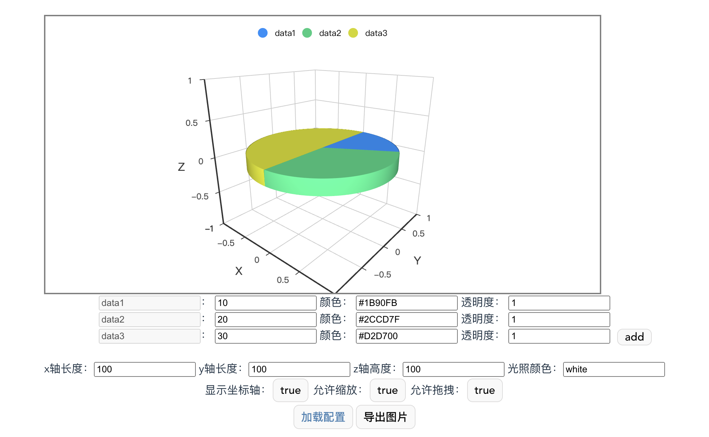

# 说明

## Run

  `npm i`  
  `npm run dev`

  如果运行失败可能是 [node](https://nodejs.org/en/download/) 版本导致的，官网提示 Vite3 需要Node.js 14.18+、16+

## 效果

  

## 备注

  最近写项目碰到的需求，抽空单独拎出来整理一下，鼠标移入可能会卡顿，这是为了保证每个面都能贴合，所以生成了很多个面，否则中间会有空隙
  觉得卡可以将曲面方程 302 行 step 的值稍微增大以此来减少生成的面

  在某个图例被收起的时候如果加入了新的数据，记得将所有图例打开后再重新加载图表，否则会出现问题
